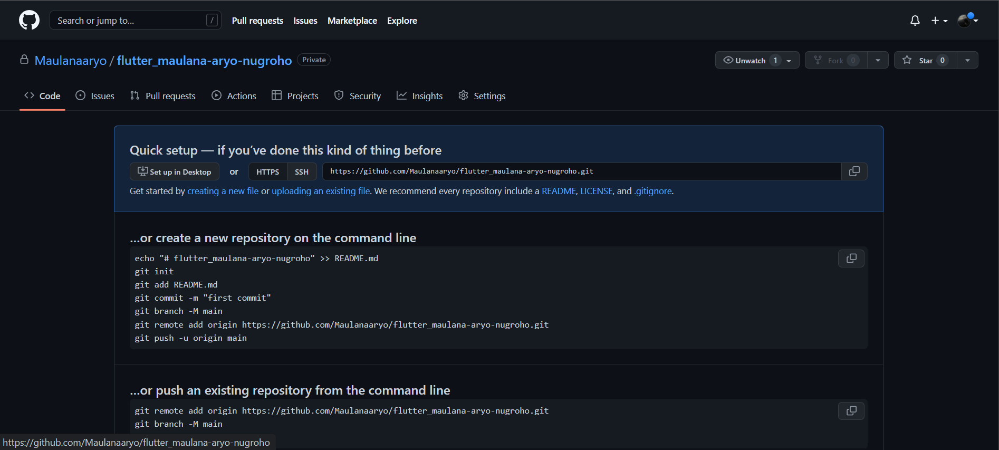

# (3) Basic Version and Branch Management (Git)

## Data Diri
Nomor Urut : 1_016FLB_36

Nama : Maulana Aryo Nugroho

## Summary
Pada section ini saya belajar tentang Basic Version  and Branch Management (Git).

## Task
### Task 01
Saya membuat sebuah repository GitHub dengan nama flutter_maulana-aryo-nugroho. Berikut adalah halaman repository GitHub.

### Task 02
