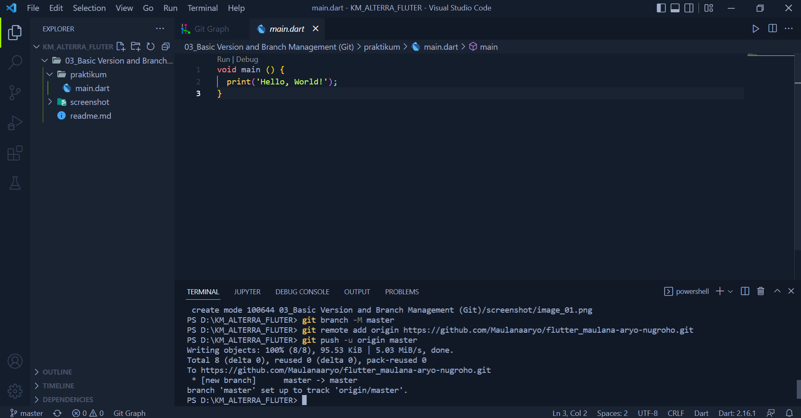
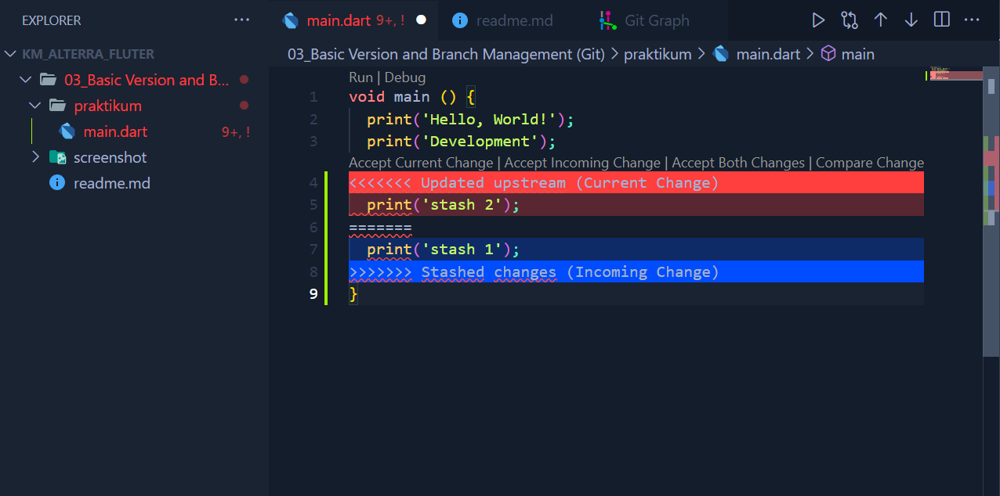
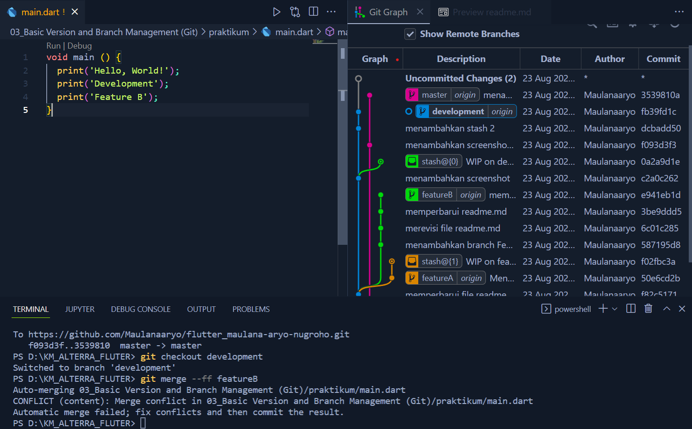
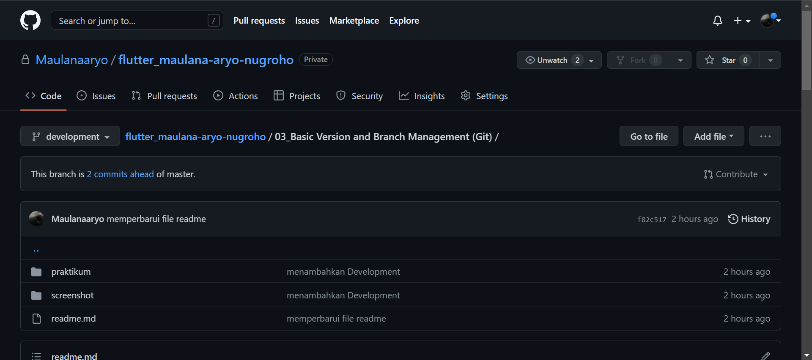
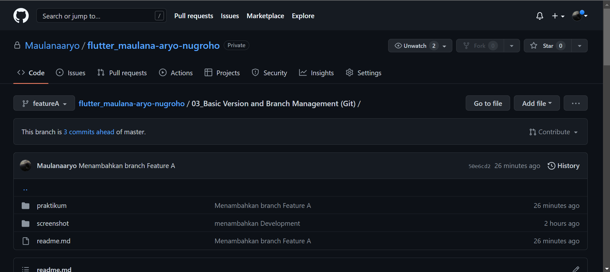
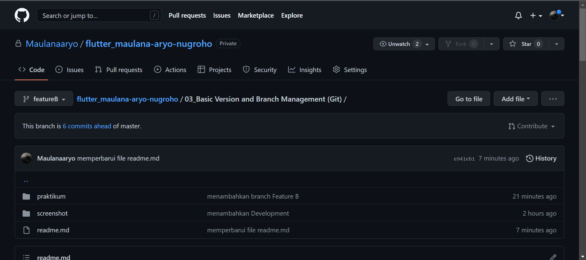
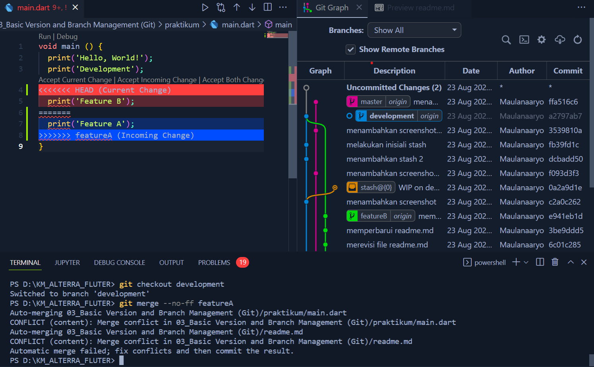

# (3) Basic Version and Branch Management (Git)

## Data Diri
Nomor Urut : 1_016FLB_36

Nama : Maulana Aryo Nugroho

## Summary
Pada section ini saya belajar tentang Basic Version  and Branch Management (Git).

## Task
### Task 01
Saya membuat sebuah repository GitHub dengan nama flutter_maulana-aryo-nugroho. Berikut adalah halaman repository GitHub.


---
### [Task 02 🗒](#descriptive-)
Melakukan perintah git push untuk memasukan file ke GitHub.


Melakukan perintah git stash.


Melakukan perintah git merge.


---
### [Task 03 🗒](#descriptive-)
Menambahkan branch Development

```git branch development```


Menambahkan branch Feature A

```git branch featureA```


Menambahkan branch Feature B

```git branch featureB```


---
### [Task 04 🗒](#descriptive-)
Melakukan perintah merge no fast forward
