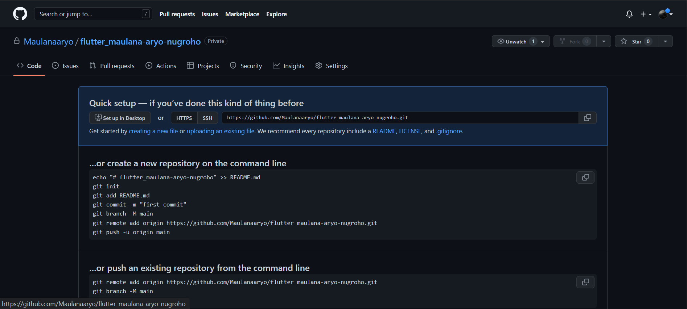
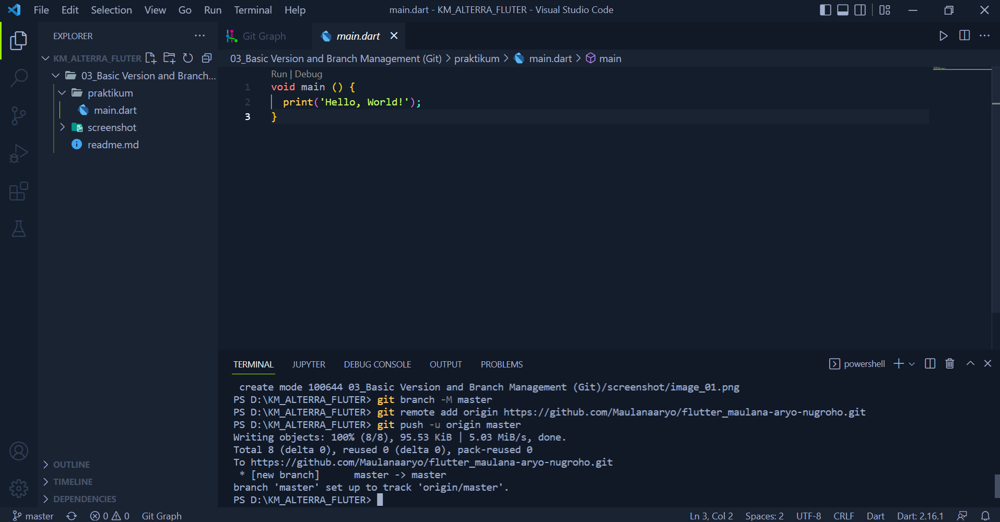
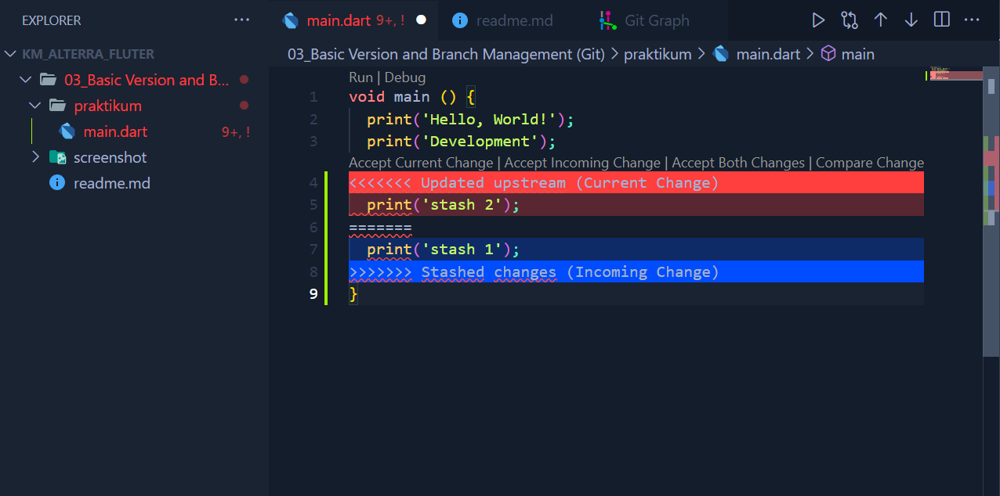
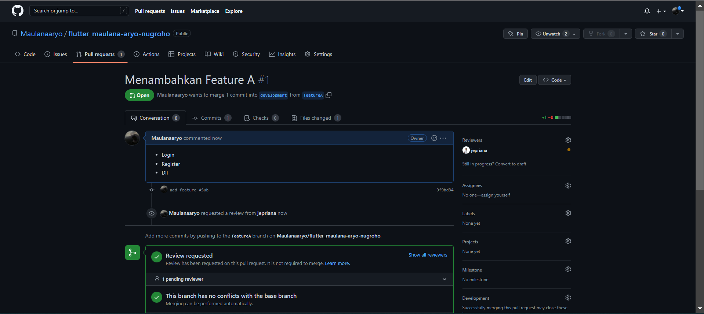
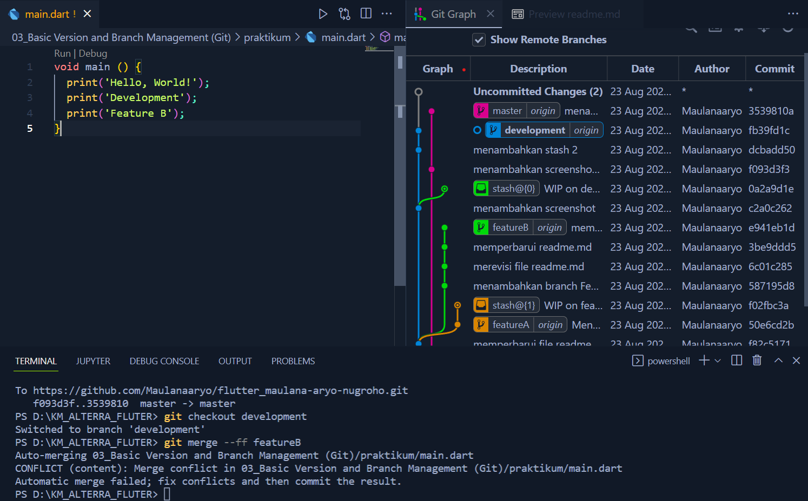
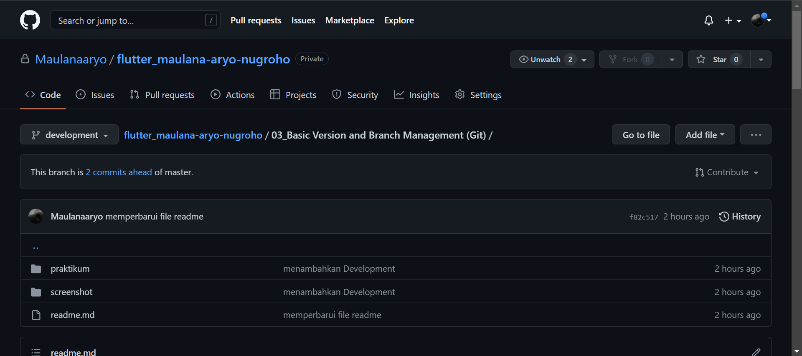
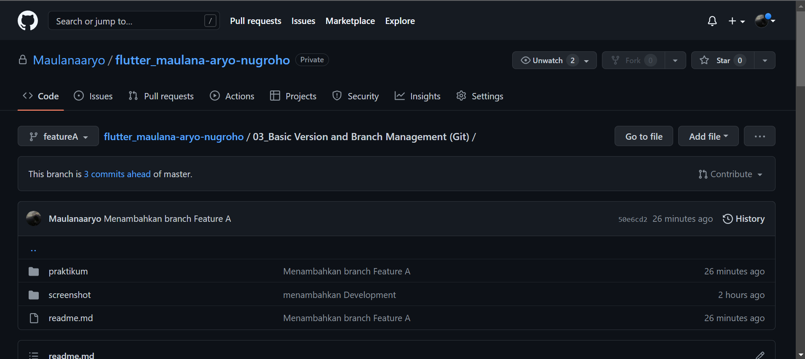
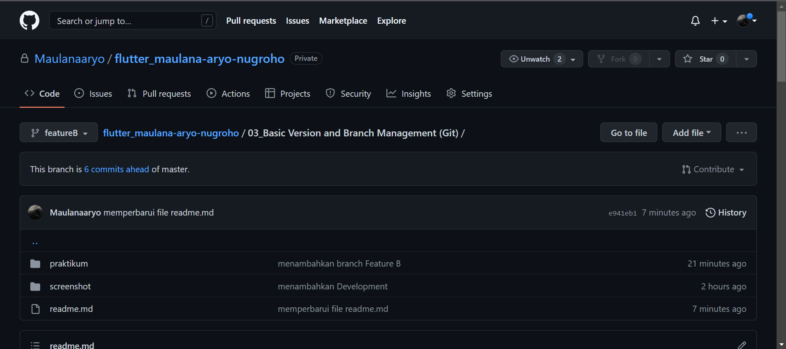
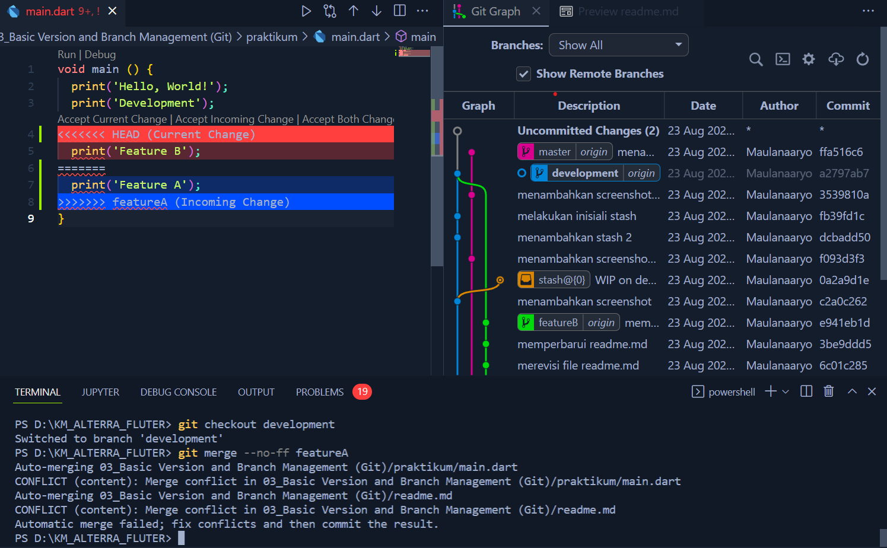
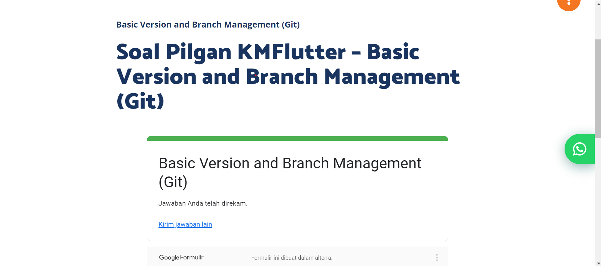

# (3) Basic Version and Branch Management (Git)

## 🙍‍♂️ Data Diri
- Nomor Urut : 1_016FLB_36
- Nama : Maulana Aryo Nugroho

## 📔 Summary
Pada section ini saya belajar tentang Basic Version  and Branch Management (Git).

### Version 
``` Mengatur versi dari source code program ```

### GIT
``` Salah satu version control system populer yang digunakan para developer untuk mengembangkan software secara bersama-bersama ```
##
### Penggunaan GIT
- GIT init perintah untuk membuat repository di file lokal
- GIT clone perintah yang digunakan untuk mengkloning repository lokal
- GIT add perintah yang digunakan untuk menambahkan file baru di repository yang dipilih
- GIT commit perintah untuk menyimpan perubahan yang sudah dilakukan, namun tidak ada perubahan yang terjadi pada remote repository
- GIT status perintah untuk mengetahui sebuah status dari sebuah repository lokal
- GIT diff perintah membandingkan perubahan yang baru saja dilakukan
- GIT stash perintah untuk menyimpan semua kode yang belum selesai dikerjakan untuk di commit
- GIT log perintah untuk melihat perubahan yang terjadi di sebuah repo
- GIT checkout perintah yang digunakan untuk menukar branch yang aktif dengan branch yang sudah dipilih
- GIT reset perintah mengembalikan file ke kondisi sebelumnya, kemudian menghapus catatan sejarah commit
- GIT revert perintah mengembalikan file dengan tidak menghapus sejarah commit
- GIT push perintah untuk mengirimkan perubahan yang dilakukan pada lokal salah satu remote
- GIT branch perintah untuk melihat semua cabang di repository dan membuat branch baru pada repository Git
- GIT pull perintah mengambil commit terbaru lalu otomatis menggabungkan (merge) dengan branch yang aktif
- GIT fetch perintah mengambil commit terbaru dan menyimpannya di branch origin/master
- GIT merge perintah yang digunakan untuk menggabungkan cabang aktif serta cabang yang dipilih
- GIT remote perintah untuk melihat daftar namespace dari setiap repository non-lokal alias sebuah remote yang terlibat dalam satu direktori Git

### PULL REQUEST

``` Suatu permintaan untuk menggabungkan (merge) kode yang kita modifikasi dengan repository utama atau repository lain ```

---
## 📘 Task
### [Task 01 🗒](#descriptive-)
Saya membuat sebuah repository GitHub dengan nama flutter_maulana-aryo-nugroho. Berikut adalah halaman repository GitHub.


---
### [Task 02 🗒](#descriptive-)
Melakukan perintah git push untuk memasukan file ke GitHub.


Melakukan perintah git stash.


Melakukan perintah pull request.


Melakukan perintah git merge.


---
### [Task 03 🗒](#descriptive-)
Menambahkan branch Development

```git branch development```


Menambahkan branch Feature A

```git branch featureA```


Menambahkan branch Feature B

```git branch featureB```


---
### [Task 04 🗒](#descriptive-)
Melakukan perintah merge no fast forward


---
### [Task 05 🗒](#descriptive-)
Mengerjakan soal pilihan ganda
