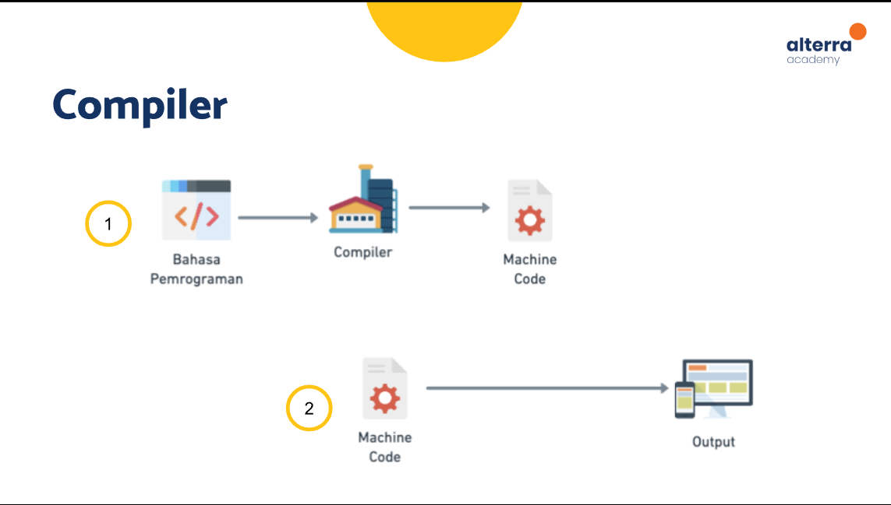
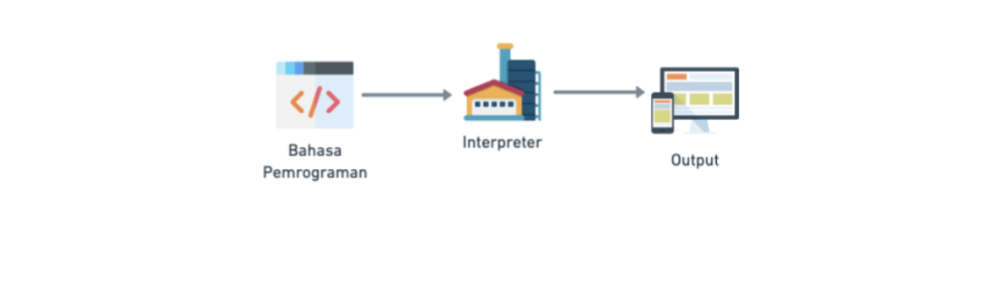
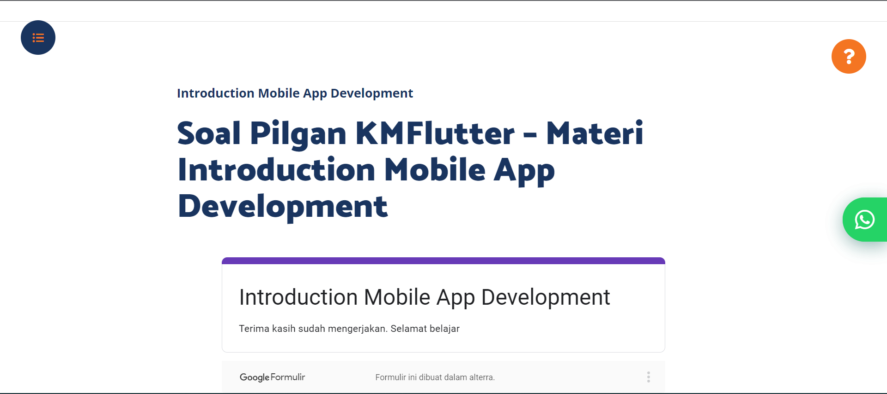
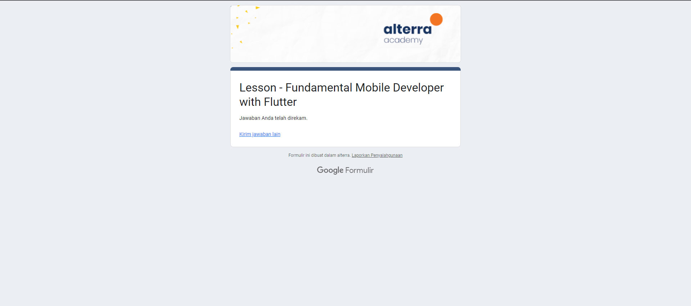

# (4) Introduction Mobile App Development

# 🙍‍♂️ Data Diri
- Nomor Urut : 1_016FLB_36
- Nama : Maulana Aryo Nugroho

# 📔 Summary
Pada section ini belajar tentang Introduction Mobile App Development.

---
## 📖 Software
``` Perangkat lunak yang tersimpan dan dapat dikendalikan pada sistem komputer, perangkat lunak tersebut terbentuk dari perintah-perintah dan tidak memiliki bentuk fisik```

### 📚 Jenis-jenis Software
### Web
- Diakses menggunakan web browser
- Memerlukan internet untuk membukanya

### Desktop
- Berjalan pada perangkat desktop
- Umumnya perlu langkah instalasi
- Dapat dibuka tanpa memerlukan internet

### Mobile
- Berjalan pada perangkat mobile (smartphone atau tablet)
- Umumnya perlu langkah instalasi
- Instalasi dapat dilakukan melalui store penyedia aplikasi
- Dapat dibuka tanpa memerlukan internet

## 📖 Bahasa Pemrograman
``` Rangkaian teks yang digunakan untuk memberi perintah kepada komputer ```

- Game Developer menggunakan bahasa pemrograman C++ / C# untuk membuat game
- Web Developer menggunakan bahasa pemrograman HTML / CSS / JavaScript dan PHP untuk membuat website
- Mobile App Developer menggunakan bahasa pemrograman Java / Kotlin untuk membuat aplikasi android dan bahasa pemrograman Swift / Objective-C untuk membuat aplikasi iOS
- Data Scientist menggunakan bahasa pemrograman Phyton untuk analisa data dan riset data
- Dekstop Developer menggunakan bahasa pemrograman C++ / Java / C# untuk membuat aplikasi dekstop
- Multi-Platform App Developer menggunakan bahasa pemrograman Dart untuk membuat aplikasi mobile, web, dekstop

## 📖 Compiler
``` Software yang digunakan untuk membaca perintah-perintah dalam bahasa pemrograman dan mengubahnya ke bahasa lain, biasanya ke dalam bentuk yang dikenali oleh komputer, seperti machine code ```

- Cara kerja Compiler


## 📖 Interpreter
``` Software yang digunakan untuk membaca perintah-perintah dalam bahasa pemrograman dan menjalankan langsung perintah-perintah tersebut ```
- Cara kerja Interpreter


### 📚 Perbandingan Compiler dan Interpreter
Compiler
- Mengubah kode menjadi file yang dapat dijalankan
- Prosesnya lebih panjang
- Program dapat dijalankan dengan cepat karena tidak membaca ulang kode

Interpreter
- Membaca kode tanpa mengubah ke bentul lain
- Prosesnya lebih singkat
- Seringkali lebih lambat karena harus membaca ulang keseluruhan kode

## 📖 Mobile App Development
``` Proses pengembangan aplikasi untuk perangkat mobile ```

### iOS
- Berjalan pada sistem operasi iOS
- perangkat hanya dikembangkan oleh Apple

### Android
- Berjalan pada sistem operasi Android
- Perangkat berkembang luas karena open source

---
## 📘 Task
### [Task 01 🗒](#descriptive-)
Mengerjakan soal pilihan ganda


---
### [Task 02 🗒](#descriptive-)
Mengerjakan soal latihan fundamental mobile developer 1

https://docs.google.com/document/d/11offlFU6GCrWrpkwvTZzVtxOFzNpdMzfCxBLYwQEiGY/edit