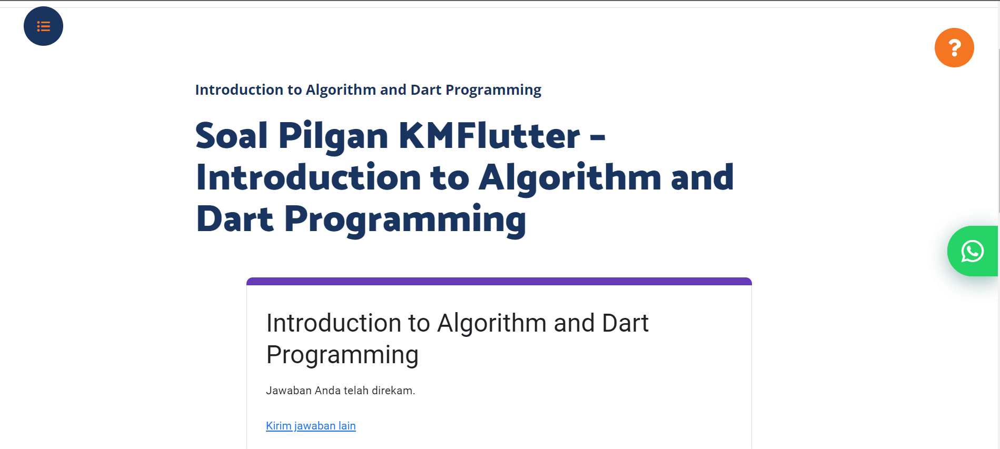
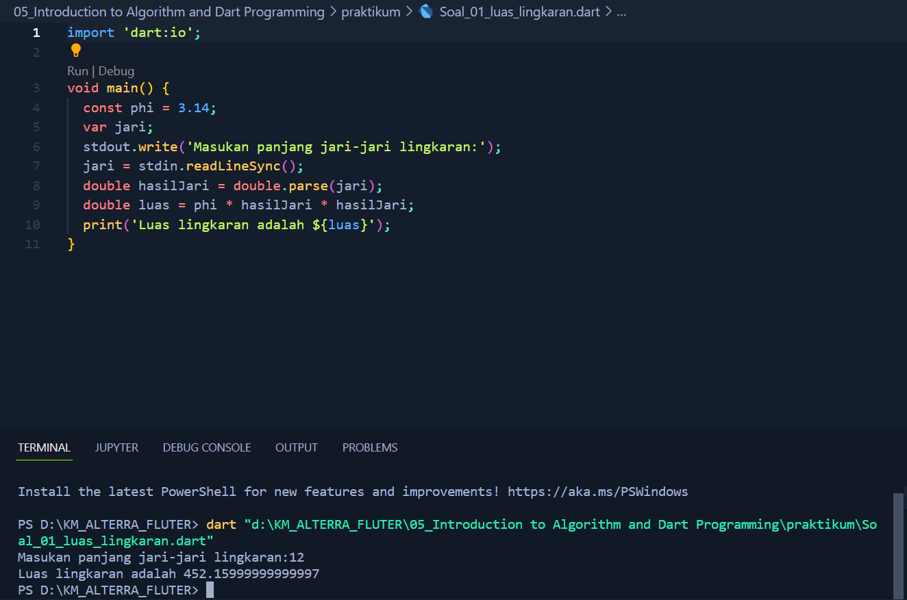
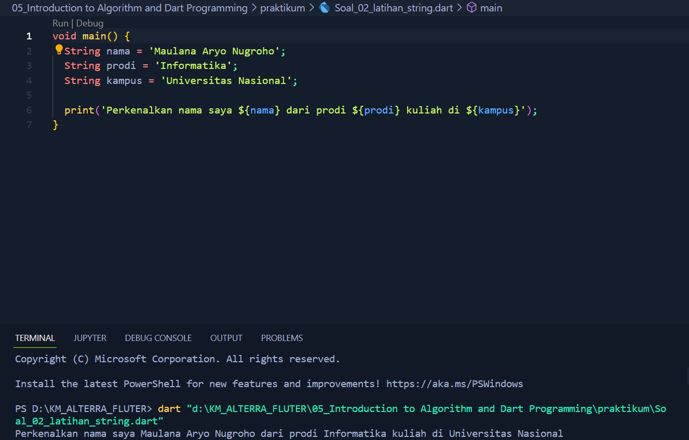

# (5) Introduction to Algorithm and Dart Programming

# 👨Data Diri
- Nomor Urut : 1_016FLB_36
- Nama : Maulana Aryo Nugroho

# 📔Summary
Pada section ini belajar tentang Introduction to Algorithm and Dart Programming.


## 📚 Dart
``` Bahasa pemrograman yang dirancang untuk membuat aplikasi agar dapat berjalan dengan cepat ```

### 📗 Apa itu Dart ? 
### 📖 Aplikasi yang dibuat dengan Dart adalah aplikasi yang berjalan disisi client (frondend), seperti:
- Web (JavaScript)
- Dekstop (Dart)
- Mobile (Dart)

### 📖 Kenapa (harus) Dart ?
- Type safe ``` menjamin konsisten tipe data ```
- Null safety ``` memberi keamanan dari data bernilai hampa (null) ```
- Rich standard library ``` hadir dengan banyak dukungan library internal ```
- Multiplatform ``` mampu berjalan pada berbagai jenis perangkat ```

### 📖 Program Dart Sederhana
- Fungsi Main
- Perintah print digunakan untuk menampilkan data ke layar

### 📘 Komentar
``` Baris kode yang tidak dijalankan dengan tujuan : ```

- Memberi catatan pada kode
- Mencegah perintah dijalankan

### 📗 Variabel
``` Variabel digunakan untuk menyimpan data, memiliki nama, dan memiliki tipe data ```

- Deklarasi variabel

Menggunakan var dan diikuti nama variabel secara otomatis tipe data variabel tersebut adalah Null.

Memberi nilai pada variabel menggunakan tanda sama dengan (=).

Inisiasi Variabel deklarasi dan memberi nilai variabel secara bersamaan.

### 📙 Konstanta
``` Digunakan untuk menyimpan sebuah data, memiliki nama, memiliki tipe data, dan nilai tetap (tidak dapat diubah) ```
- Membuat Konstanta

Menggunakan final, diikuti nama, dan diberikan nilai secara langsung

### 📘 Tipe Data
``` Jenis data yang dapat dikelola dan tipe data sederhana disebut primitive data type ```

### 📖 Jenis-Jenis Tipe Data
- Int ```bilangan bulat```
- double ```bilangan pecahan```
- bool ```true/false```
- string ```teks```

### 📗 Operator
``` Digunakan untuk operasi pengolahan data dan data yang dikelola disebut operand ```

- Arithmetic ```untuk perhitungan matematis``` (+,-,/,%)
- Assignment ```memberi nilai pada variabel``` (=,+=,-=,*=,/=,%=)
- Comparison ```membandingkan kesetaraan nilai``` (==,<,<=,>,>=)
- Logical ``menggabungkan beberapa kondisi```
(&&,||,!)

---
## 📒 Task
### [Task 01 🗒](#descriptive-)
Mengerjakan soal pilihan ganda, pada materi section_05


### [Task 02 🗒](#descriptive-)
Mengerjakan tugas praktikum no.1 dengan membuat luas lingkaran


### [Task 03 🗒](#descriptive-)
Mengerjakan tugas praktikum no.2 dengan membuat 3 buah variabel berisi string
