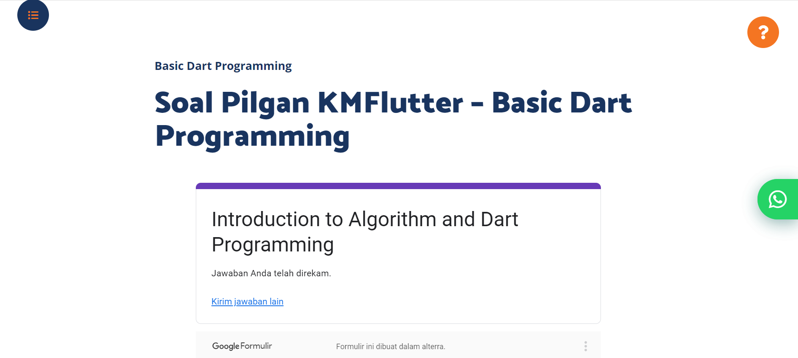

# (6) Basic Dart Programming

# 👨Data Diri
- Nomor Urut : 1_016FLB_36
- Nama : Maulana Aryo Nugroho

# 📔Summary
Pada section ini belajar tentang Basic Dart Programming.

### 📙 Fungsi (Lanjutan)
📖 Anonymous Function
- Tidak memiliki nama
- Fungsi sebagai data

📖 Arrow Function
- Dapat memiliki nama atau tidak
- Berisi 1 data (dari proses maupun data statis)
- Nilai return fungsi ini diambil dari data tersebut

### 📗 Async-Await
- Menjalankan beberapa proses tanpa perlu menunggu
- Proses ditulis dalam bentuk fungsi
- Await akan menunggu hingga proses async selesai

### 📘 Tipe Data Future
- Data yang dapat ditunggu
- Membawa data return dari fungsi async

### 📙 Collection
``` Struktur data yang lebih canggih untuk menangani masalah yang lebih kompleks, collection dapat menyimpan data atau object lain pada satu tempat ```
- List ```Menyimpan data secara berbaris dan setiap data memiliki index```
- Map ```Menyimpan data secara key-value, key berguna selayaknya index pada list```

---
## 📒 Task
### [Task 01 🗒](#descriptive-)
Mengerjakan soal pilihan ganda, pada materi section_05_Basic Dart Programming

