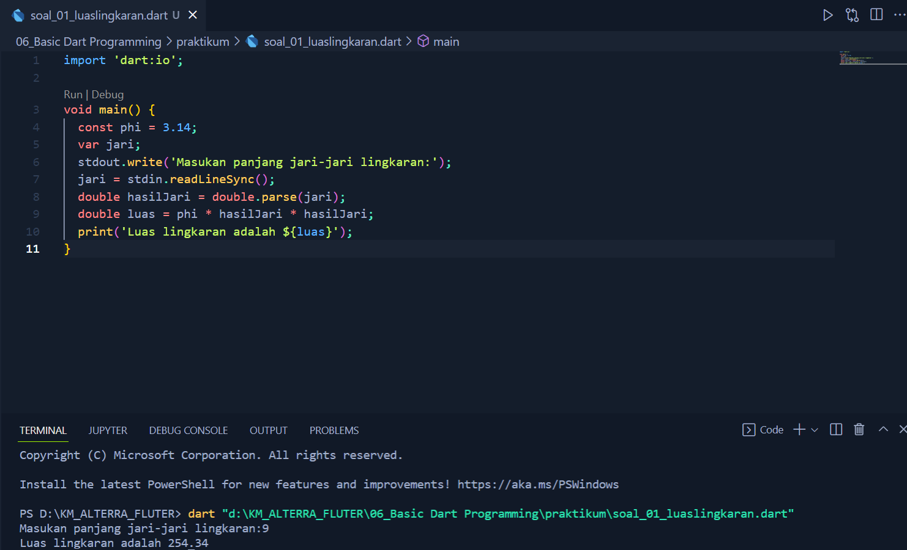
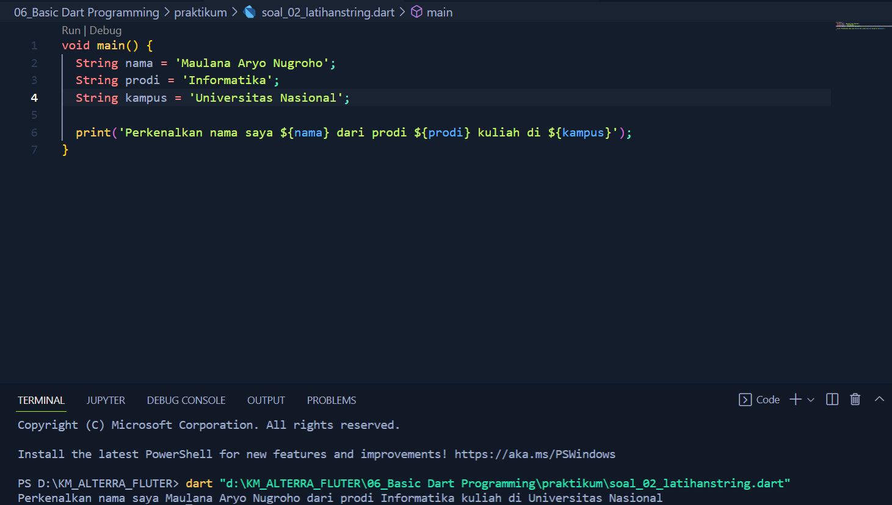

# (6) Basic Dart Programming

# 👨Data Diri
- Nomor Urut : 1_016FLB_36
- Nama : Maulana Aryo Nugroho

# 📔Summary
Pada section ini belajar tentang Basic Dart Programming.

## 📚 Dart
``` Bahasa pemrograman yang dirancang untuk membuat aplikasi agar dapat berjalan dengan cepat ```

### 📗 Apa itu Dart ? 
### 📖 Aplikasi yang dibuat dengan Dart adalah aplikasi yang berjalan disisi client (frondend), seperti:
- Web (JavaScript)
- Dekstop (Dart)
- Mobile (Dart)

### 📖 Kenapa (harus) Dart ?
- Type safe ``` menjamin konsisten tipe data ```
- Null safety ``` memberi keamanan dari data bernilai hampa (null) ```
- Rich standard library ``` hadir dengan banyak dukungan library internal ```
- Multiplatform ``` mampu berjalan pada berbagai jenis perangkat ```

### 📖 Program Dart Sederhana
- Fungsi Main
- Perintah print digunakan untuk menampilkan data ke layar

### 📘 Komentar
``` Baris kode yang tidak dijalankan dengan tujuan : ```

- Memberi catatan pada kode
- Mencegah perintah dijalankan

### 📗 Variabel
``` Variabel digunakan untuk menyimpan data, memiliki nama, dan memiliki tipe data ```

- Deklarasi variabel

Menggunakan var dan diikuti nama variabel secara otomatis tipe data variabel tersebut adalah Null.

Memberi nilai pada variabel menggunakan tanda sama dengan (=).

Inisiasi Variabel deklarasi dan memberi nilai variabel secara bersamaan.

### 📙 Konstanta
``` Digunakan untuk menyimpan sebuah data, memiliki nama, memiliki tipe data, dan nilai tetap (tidak dapat diubah) ```
- Membuat Konstanta

Menggunakan final, diikuti nama, dan diberikan nilai secara langsung

### 📘 Tipe Data
``` Jenis data yang dapat dikelola dan tipe data sederhana disebut primitive data type ```

### 📖 Jenis-Jenis Tipe Data
- Int ```bilangan bulat```
- double ```bilangan pecahan```
- bool ```true/false```
- string ```teks```

### 📗 Operator
``` Digunakan untuk operasi pengolahan data dan data yang dikelola disebut operand ```

- Arithmetic ```untuk perhitungan matematis``` (+,-,/,%)
- Assignment ```memberi nilai pada variabel``` (=,+=,-=,*=,/=,%=)
- Comparison ```membandingkan kesetaraan nilai``` (==,<,<=,>,>=)
- Logical ``menggabungkan beberapa kondisi```
(&&,||,!)

### 📙 Fungsi (Lanjutan)
📖 Anonymous Function
- Tidak memiliki nama
- Fungsi sebagai data

📖 Arrow Function
- Dapat memiliki nama atau tidak
- Berisi 1 data (dari proses maupun data statis)
- Nilai return fungsi ini diambil dari data tersebut

### 📗 Async-Await
- Menjalankan beberapa proses tanpa perlu menunggu
- Proses ditulis dalam bentuk fungsi
- Await akan menunggu hingga proses async selesai

### 📘 Tipe Data Future
- Data yang dapat ditunggu
- Membawa data return dari fungsi async

### 📙 Collection
``` Struktur data yang lebih canggih untuk menangani masalah yang lebih kompleks, collection dapat menyimpan data atau object lain pada satu tempat ```
- List ```Menyimpan data secara berbaris dan setiap data memiliki index```
- Map ```Menyimpan data secara key-value, key berguna selayaknya index pada list```

---
## 📒 Task
### [Task 01 🗒](#descriptive-)
Mengerjakan soal pilihan ganda, pada materi section_05_Basic Dart Programming


### [Task 02 🗒](#descriptive-)
Mengerjakan soal latihan Fundamental Mobile Developer 2, No.1 implementasi rumus luas lingkaran


### [Task 03 🗒](#descriptive-)
Mengerjakan soal latihan Fundamental Mobile Developer 2, No.2 buat 3 buah variabel berisi string


Bukti pengiriman Gform dan Link Gdocs

https://docs.google.com/document/d/1cKlZ3_66OfPytFOdX3uT9s4VFEz4WxxJc9aMZLAjoZg/edit
